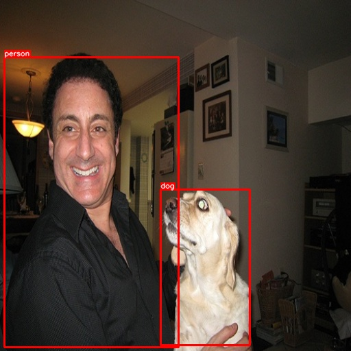

# Object detection

Object detection is the task of locating and classifying different types of objects
in images. AllenCV provides some of the common network architectures for training
object detection models from scratch, but also provides the ability to leverage 
state-of-the-art pre-trained models.

## Data

Set up your environment.

```bash
export ALLENCV_DIR=path/to/allencv
cd $ALLENCV_DIR
mkdir data && cd data
```

Download and split PascalVOC data

```
wget http://host.robots.ox.ac.uk/pascal/VOC/voc2007/VOCtrainval_06-Nov-2007.tar
tar xf VOCtrainval_06-Nov-2007.tar

export VOCDIR=$PWD/VOCdevkit/VOC2007
mkdir pascal_voc_segmentation && cd pascal_voc_segmentation
for DIR in 'train' 'val'
do
  mkdir $DIR
  mkdir $DIR/masks
  mkdir $DIR/images
  ls $VOCDIR/SegmentationClass | shuf -n 200 | xargs -i mv $VOCDIR/SegmentationClass/{} $DIR/masks/
  ls $DIR/masks | sed -e 's/\.png$/\.jpg/' | xargs -i mv $VOCDIR/JPEGImages/{} $DIR/images/
done
cd ..
unset VOCDIR
```

## Inference with a pre-trained Faster R-CNN model

Use a no-op `Trainer` to generate a model archive for a pre-trained model.

```bash
TRAIN_PATH=$ALLENCV_DIR/data/pascal_voc_segmentation/train \
allennlp train $ALLENCV_DIR/training_config/pretrained_faster_rcnn.jsonnet \
--include-package allencv.data.dataset_readers.image_annotation_reader \
--include-package allencv.modules.image_encoders \
--include-package allencv.modules.image_decoders \
--include-package allencv.modules.im2vec_encoders \
--include-package allencv.models.object_detection.region_proposal_network \
--include-package allencv.models.object_detection.faster_rcnn \
-s models/pretrained0
```

We can now use AllenNLP's `predict` command to make predictions on a test input. First,
create a simple input json file.

```bash
echo '{"image_path": "/path/to/test/image.jpg"}' > test_input.json
```

Make predictions on an input image.

```bash
allennlp predict models/pretrained0/model.tar.gz test_input.json \
--output-file test_prediction.json --silent --predictor faster_rcnn \
--include-package allencv.data.dataset_readers.image_annotation_reader \
--include-package allencv.modules.image_encoders \
--include-package allencv.modules.image_decoders \
--include-package allencv.modules.im2vec_encoders \
--include-package allencv.models.object_detection.region_proposal_network \
--include-package allencv.models.object_detection.faster_rcnn \
--include-package allencv.predictors.object_detection.faster_rcnn 
```

The output of the model will be a json file containing various prediction fields for each image:

```
{
"scores": [0.99001944, 0.82276326], 
"labels": [1., 17.], 
"decoded": [
    [ 6.048294,  83.67108 , 260.5799  , 506.15118], 
    [234.09766 , 276.13324 , 364.14117 , 503.4488]],
"class": ["person", "dog"]
```



